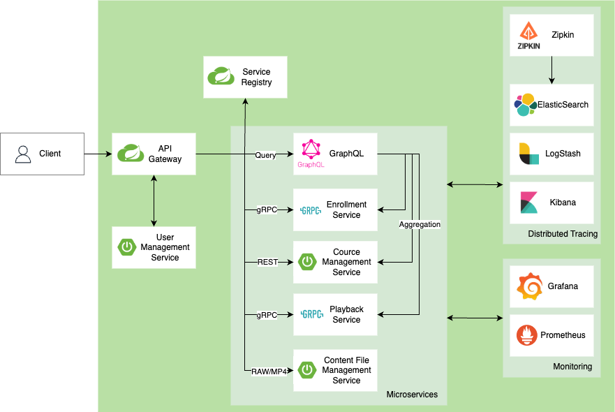

## 1. 서비스 간 통신 방법
- 통신 방법
  - 서비스 간 통신 방법으로 RESTful API, gRPC 사용
  - 이번 프로젝트에서는 **Event-Driven Architecture**는 도입하지 않고 전체 적인 GraphQL, gRPC, RESTful API 의 통신 방법 위주로 개발 예정  
- API Gateway 역할
  - 모든 API 진입점, 로그인/JWT 인증을 담당
  - Public API/Internal API 관리
    - 외부(External) API : Authentication, GraphQL, File Serving Service
    - 로그인과 파일 재생을 제외한 모든 통신은 GraphQL을 통해서 이루어 짐
- 모니터링 및 보안
  - Prometheus 로 각 컴포넌트의 Metrics 수집, Grafana 대시보드를 통해 컴포넌트 Metrics 시각화
  - Zipkin을 통해 각 컴포넌트의 트랜잭션 데이터 수집 후 ElasticSearch에 저장
  - Kibana를 통해서 요청 데이터 시각화

## 2. Database per Service 패턴
- https://microservices.io/patterns/data/database-per-service.html
- 컴포넌트 DB는 MySQL사용, 논리 DB로 분리 사용
- **논리적 데이터베이스 분리**: 각 서비스가 독립적으로 관리하는 데이터베이스는 물리적으로는 같은 데이터베이스 클러스터 내에 존재할 수 있지만, 논리적으로는 완전히 분리
- **데이터베이스 선택**: 각 서비스의 특성에 맞는 데이터베이스를 선택 필요하지만, 이번 프로젝트에서는 MySQL을 메인 DB로 사용할 예정

## 3. 각 서비스 컴포넌트 정의
### GraphQL 서비스
- 여러 컴포넌트의 데이터를 Aggregation 하는 역할

### 사용자 관리 서비스 (User Management Service)
- 사용자 인증 및 프로필 관리

### 강의 관리 서비스 (Course Management Service)
- 강의 및 세션 정보 관리
- 강의 평가 관리

### 강의 등록/권한 서비스 (Enrollment Service)
- 사용자가 구매한 강의, 이용권 권한 정보 관리

### 컨텐츠 파일 관리 서비스 (Content File Management Service)
- 강의 컨텐츠 파일 관리

### 재생 서비스 (Playback Service)
- 사용자의 강의 재생 세션 및 이벤트 추적